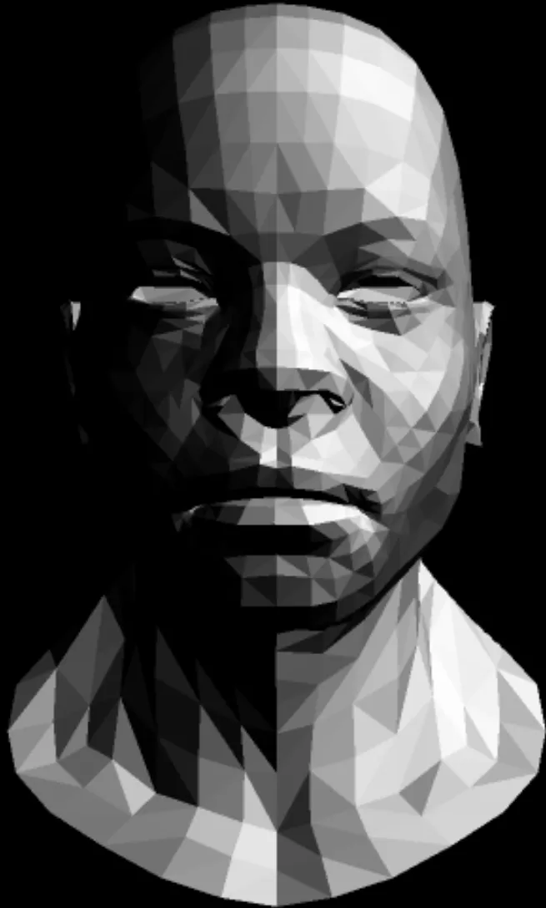
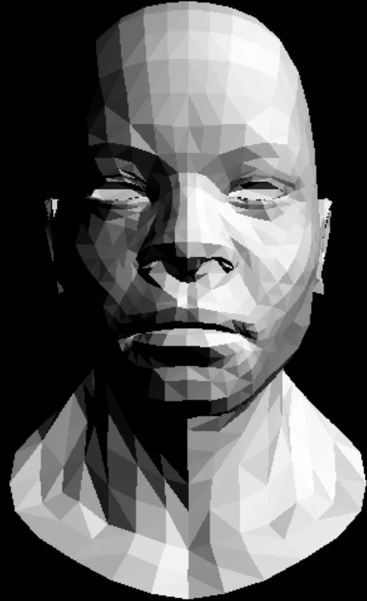
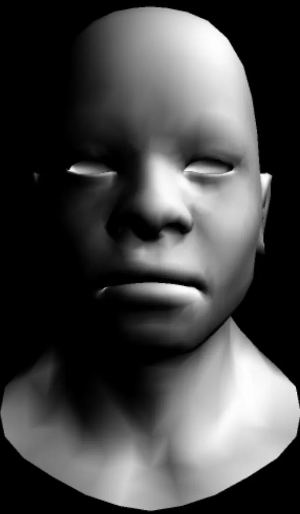
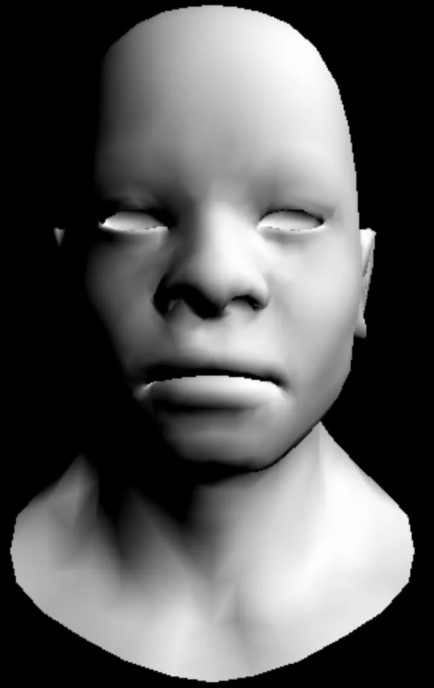
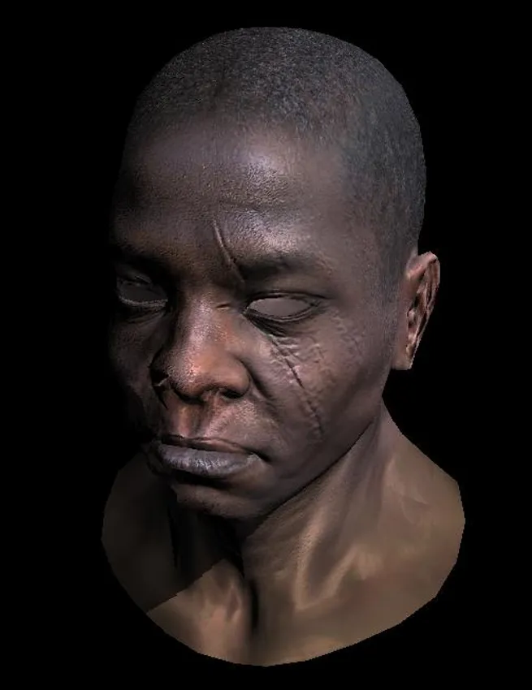
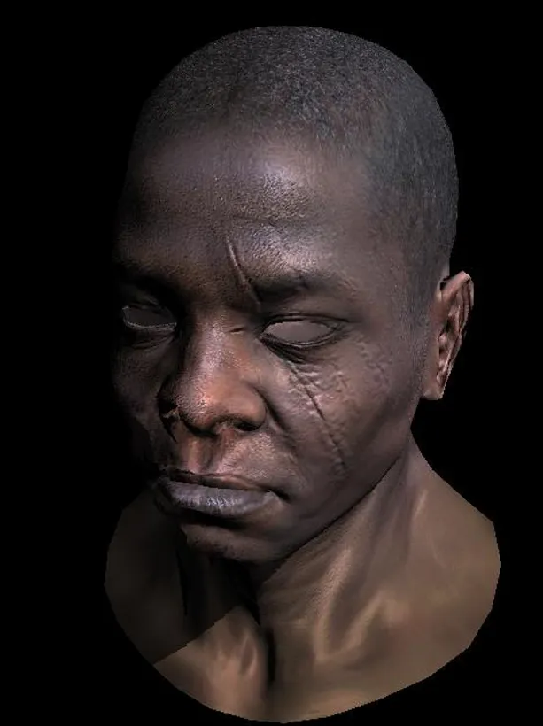

# tiny-render
实现一个轻量级软件渲染管线，支持3D模型加载、坐标变换、纹理映射、光照计算等功能 
在原作者的基础上初步实现了SSAA*4效果，尝试了flat,vetex,phone shading 效果。
最后实现了初步的shadow mapping和纹理贴图，尝试了从切线空间导入纹理信息，对TBN矩阵构建进行修正，正确的方法应该是需要正交化！！！

falt sahding

 

vetex shading

 

phone shading

 

正交化与未正交化 导入切线空间的纹理贴图

  
